

<h2>LAPORAN RESMI   PRAKTIKUM KEAMANAN JARINGAN   A01 – BROKEN ACCESS CONTROL</h2>

<h2>Oleh :</h2>

<h2>Tarisa Dinda Deliyanti  3122640037   Fisabili Maghfirona Firdaus  3122640051   D4 LJ Teknik Informatika B</h2>

<h2>POLITEKNIK ELEKTRONIKA NEGERI SURABAYA</h2>

<h2>TAHUN AJARAN 2022/2023</h2>

1. Menjalankan website Juice Shop menggunakan perintah “npm start” di dalam folder Juice  Shop.  Setelah  port  tersedia,  kemudian  membuka  localhost:3000

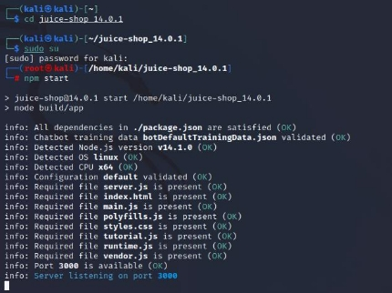

2. Berikut tampilan website yang ditampilkan di port 3000 

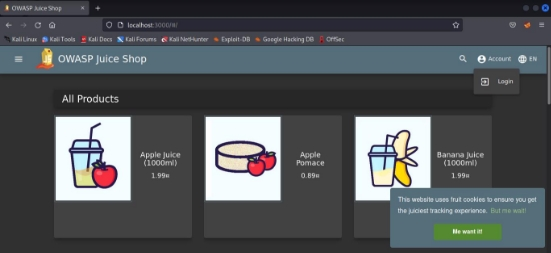

3. Mencari alamat email admin melalui review yang ada di produk Apple Juice. Alamat email admin digunakan untuk mengecek broken access control. Dari gambar di bawah ini, didapatkan informasi bahwa email admin yaitu admin@juice-sh.op 

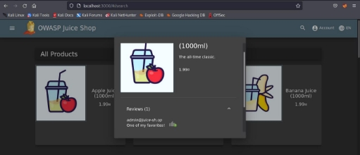

4. Menjalankan  aplikasi burpsuite. Kemudian buka Proxy lalu pilih Proxy Setting lalu pilih  Project  dan pilih  Scope. Setelah  muncul  tampilan  seperti berikut,  tambahkan prefix alamat website yang akan dibuka yaitu localhost:3000 dengan mengklik tombol “Add” di bagian include in scope 

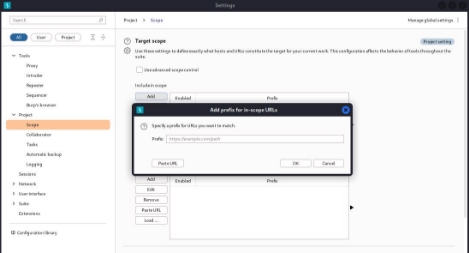

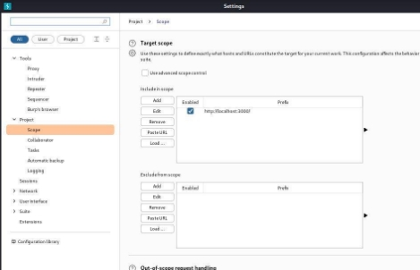

5. Klik Tools, pilih Proxy, dan centang bagian yang diberi kotak berwarna merah seperti pada gambar berikut 

6. Mengubah intercept dari off ke on. Setelah itu, kembali ke halaman login Juice Shop dan  masuk  menggunakan  email [ admin@juice-sh.op ](mailto:admin@juice-sh.op) dan  password  acak

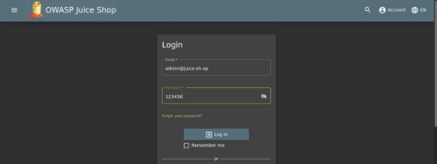

Setelah  klik  tombol  Login,  kembali  ke  burpsuite  dan  di  halaman  Intercept  klik “Forward” hingga bertemu informasi email dan password yang diinputkan sebelumnya 

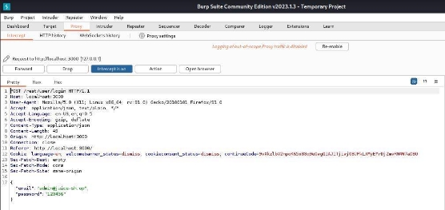

7. Klik kanan lalu pilih “Send to intruder” dan klik menu Intruder hingga muncul tampilan seperti gambar berikut 

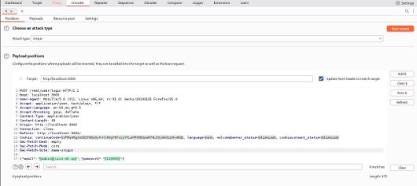

8. Membersihkan target untuk semua burte force dengan menekan tombol “Clear$” 

9. Pilih password sebagai target burte force dan klik tombol "Add$" 

10. Klik menu Payload di Intruder dan pilih file berformat .txt setelah klik tombol “Load” 

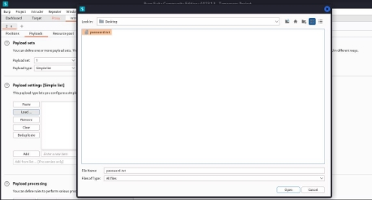

11. Setelah  file password.txt berhasil  diload akan  muncul  tampilan  yang  berisi  daftar password acak seperti berikut dan klik “Start attack” di pojok kanan 

12. Berikut hasil setelah menekan tombol “Start attack” 

Terdapat dua macam HTTP status yaitu 401 yang berarti permintaan browser ke server tidak memiliki  kredensial  autentik yang valid dan 200 yang berarti  server berhasil menerima request dari browser yang kita gunakan. 

13. Login menggunakan password dengan status 200 untuk masuk ke akun admin 

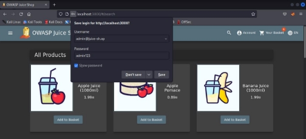

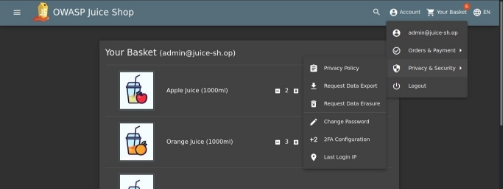

Link video presentasi OWASP A1 :[ https://youtu.be/61A7ucVB570](https://youtu.be/61A7ucVB570)  
