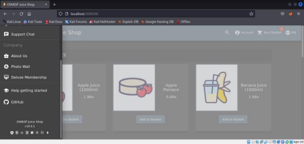
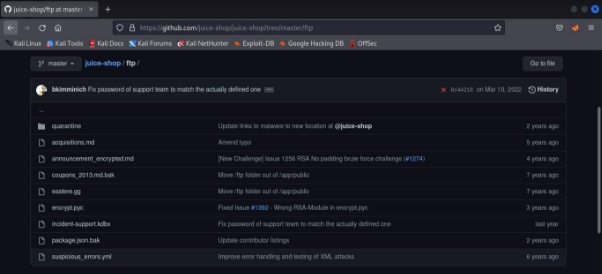
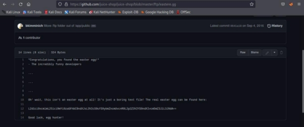
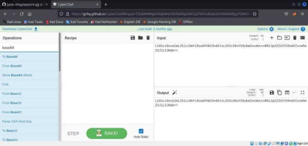
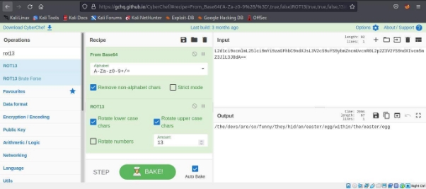
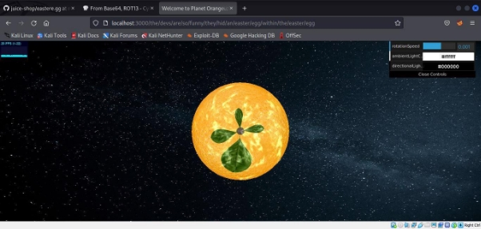



<h2>LAPORAN RESMI   PRAKTIKUM KEAMANAN JARINGAN   A02 – CRYPTOGRAPHIC FAILURES</h2>
   

  
<b>Oleh :</b>

Tarisa Dinda Deliyanti - 3122640037   Fisabili Maghfirona Firdaus - 3122640051   D4 LJ Teknik Informatika B

<h2>POLITEKNIK ELEKTRONIKA NEGERI SURABAYA</h2>

<h2>TAHUN AJARAN 2022/2023</h2>

  

1. Untuk menguji cryptographic failures, akan mencoba mencari nested easter egg. Easter egg merupakan pesan tersembunyi yang telah disisipkan kedalam website. Untuk masuk ke direktori ftp, klik github pada menu di website Juice Shop. 

2. Masuk ke direktori ftp kemudian cari file eastere.gg. Buka file tersebut dan perhatikan pesan pada file. 

3. Klik file eastere.gg dan akan tampil pesan bahwa file tersebut bukan eastere.gg yang asli dan ada kode yang ditampilkan untuk menemukan easter egg. Jadi di dalam file tersebut muncul pesan enkripsi. Kita diharuskan memecahkan kode enkripsi tersebut. 

4. Mengunjungi [ https://gchq.github.io/CyberChef/ ](https://gchq.github.io/CyberChef/) untuk  membuka  website  Cyber  Chef. Cyber Chef Aplikasi web sederhana dan intuitif untuk menganalisis dan mendekode data tanpa harus berurusan dengan alat atau bahasa pemrograman yang rumit. Copy kode dari file eastere.gg ke cyber chef 

5. Tambahkan  base64 dan encryption ROT13. Setelah menambahkan base64 dan ROT13 kedalam recipe maka muncul link menuju file tersembunyi. 

 Base64 adalah teknik pengkodean, yang mengubah data biner, seperti gambar dan video, menjadi format ASCII (skema pengkodean untuk merepresentasikan data teks dalam sistem komputer). Karena data biner terdiri dari string 0 dan 1, pengkodean Base64 bekerja dengan mengubah karakter ini menjadi himpunan ASCII yang pasti. Hasilnya dapat dengan mudah diterjemahkan dengan memetakan karakter ASCII ke dalam nilai biner. 

ROT 13 (Rotation 13) 

Salah satu contoh dari “substitution cipher” adalah Rot13. Metode rot13 merupakan metode enkripsi  yang mengubah suatu huruf menjadi huruf yang letaknya 13 posisi  dari huruf semula. Misalnya ‘A’ akan berubah menjadi ‘N’ , ‘B’ berubah menjadi ‘O’, dst. Rumusnya seperti dibawah ini : 

6. Hasil setelah menggabungkan alamat pesan tersembunyi dari website Juice Shop dan kode dipecahkan oleh cyber chef muncul teks link tambahkan link stelah port 3000. Maka akan muncul hasil seperti gambar di bawah ini 

Link video presentasi OWASP A2 :[ https://youtu.be/61A7ucVB570](https://youtu.be/61A7ucVB570) 
